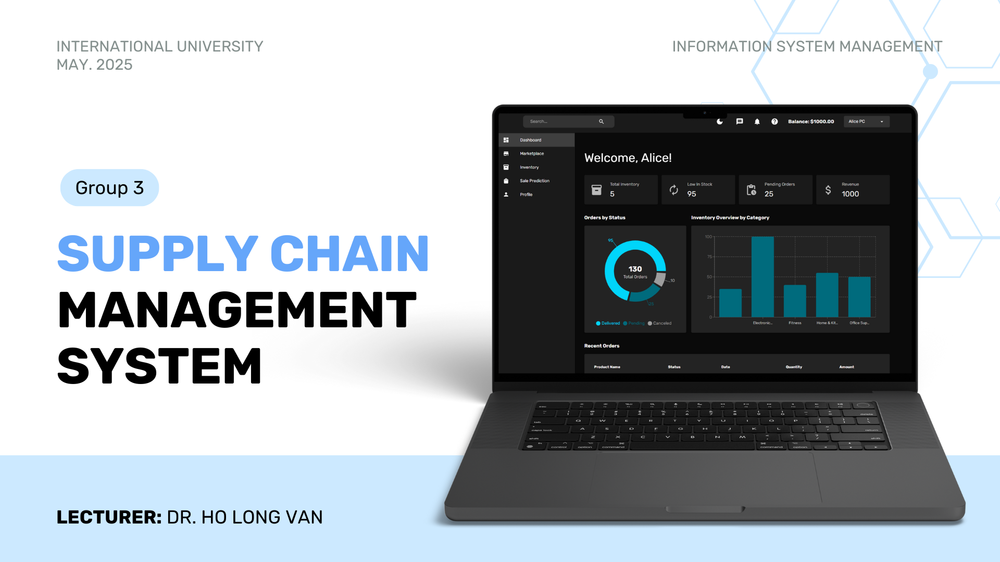

# Supply Chain Management System

The **Supply Chain Management System** is a web-based application built using the **MERN stack** and **machine learning** to streamline supplier-employee interactions, inventory management, and demand forecasting.

## 

## 📊 Core Modules

### 🛒 Supplier Marketplace

- Suppliers list products with name, description, price, and stock quantity.
- Products are available for employees to browse and order.

### 📅 Employee Order Portal

- Employees can browse the marketplace, place orders, and track statuses.

### 🏢 Warehouse Inventory Management

- Purchased products are added to inventory with quantity and sold details.
- Low stock alerts appear when inventory falls below reorder thresholds.

### 🧪 Sales and Demand Forecasting

- ML models predict future sales using historical data.

---

## ⚖️ How It Works

1. **Product Listing**: Suppliers add products with stock levels.
2. **Order Placement**: Employees order items from the marketplace.
3. **Order Confirmation**: Suppliers confirm orders, triggering inventory updates.
4. **Inventory Management**: Products are added to and managed in inventory.
5. **Sales Prediction**: Historical data is analyzed to forecast sales.

---

## 🛠️ Technologies Used

### Web App (MERN)

- **MongoDB**: NoSQL database
- **Express.js**: Backend framework
- **React**: Frontend UI
- **Node.js**: Server environment

### Machine Learning

- **Flask**: ML model deployment
- **NumPy, Pandas**: Data analysis
- **Scikit-learn**: ML algorithms
- **Jupyter Notebook**: Model development

### Testing Tools

- **Postman**: API testing
- **MongoDB Compass**: DB inspection

---

## 📃 Setup Instructions

### 1. Clone the Repository

```bash
git clone https://github.com/TracyHT/ISM--Supplychain-Management-System.git
cd ISM--Supplychain-Management-System
```

### 2. Backend Setup

```bash
cd server
npm install
```

Start server:

```bash
npm start
```

### 3. Frontend Setup

```bash
cd client
npm install
npm run dev
```

### 4. Machine Learning Setup

Please follow the README.md inside "Sales Prediction Model" folder.

---

## 🔧 Testing

### Test Accounts

- **Employee**: `a@gmail.com`, Password: `123456`
- **Supplier**: `b@gmail.com`, Password: `123456`

### Instructions

- **Login**: Use test accounts.
- **Supplier**: Add products, confirm orders.
- **Employee**: Order products, view dashboard stats, update inventory.

---

## 📚 Credits

Based on the original project by Akhil Binoy: [Intelligent-Supplychain-Management-System](https://github.com/akhil888binoy/Intelligent-Supplychain-Management-System)
